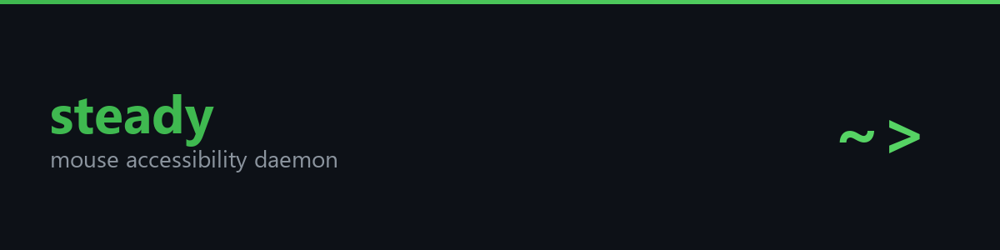
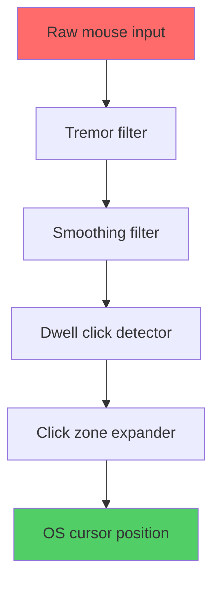

<p align="center">
  
</p>

<p align="center">
  <a href="https://github.com/zandenkane/steady/actions/workflows/ci.yml"></a>
  
  
</p>

if your mouse cursor has a mind of its own, this is for you.

steady is a daemon that sits between the mouse and the OS. it intercepts raw pointer events, runs them through configurable filters (tremor smoothing, dwell clicking, pointer stabilization), and reinjects the cleaned up position. cursor goes where you meant it to go. works system-wide on Windows, Linux, and macOS.

## What the filters do

**Tremor rejection** eats micro movements below a pixel threshold. Hand tremor produces rapid tiny jitters that this filter swallows. Intentional moves pass through.

**One Euro smoothing** applies heavy damping when the pointer is near still (kills residual jitter) and backs off when you move fast (so intentional gestures feel responsive). Based on the Casiez et al. CHI 2012 algorithm.

**Click zone snapping** lets you define target zones in config. When the pointer enters a zone, it locks to the center. Good for taskbar icons, big buttons, or anything you hit often.

**Dwell click** fires a left click automatically if the filtered pointer holds still long enough. Runs on the filtered stream, so tremor does not constantly reset the timer.

Each filter is independent. Turn on whichever ones help, leave the rest off.


## how it works



```
$ steady --config steady.toml
[steady] loaded config: tremor=0.7 smooth=0.5 dwell=800ms zone=1.5x
[steady] backend: windows (RawInput)
[steady] pipeline active. ctrl+c to stop.
[steady] stats (last 60s): 12,847 events filtered, 94% jitter removed
```

## Install

```
git clone https://github.com/zandenkane/steady.git
cd steady
cargo build --release
```

Binary goes to `target/release/steady` (or `steady.exe` on Windows).

## Usage

```
# start with default settings
steady start

# start with a custom config
steady start --config path/to/config.toml

# dump default config to a file, then edit it
steady defaults > config.toml

# check where the config file lives and whether it parses
steady status

# validate a config without starting the daemon
steady validate --config path/to/config.toml
```

## Config

Config file location:
- Windows: `%APPDATA%\steady\config.toml`
- Linux/macOS: `~/.config/steady/config.toml`

All fields are optional. Missing fields use defaults. Here is the full set:

```toml
[tremor]
enabled = true
threshold = 3.0       # pixels, movements smaller than this get swallowed

[smoothing]
enabled = true
min_cutoff = 1.0      # Hz, lower = more smoothing at rest
beta = 0.007          # speed coefficient, higher = less smoothing when moving fast

[dwell]
enabled = false
time_ms = 800.0       # milliseconds of stillness before a click fires
radius = 10.0         # pixels, movement within this counts as still

[clickzones]
enabled = false

[[clickzones.zones]]
x = 960.0
y = 540.0
radius = 30.0
```

For mild tremor, the defaults are fine. For more severe tremor, bump `tremor.threshold` to 5 or 8 and lower `smoothing.min_cutoff` to 0.3 for heavier damping.

## Platform support

Windows works today (low level mouse hook via `SetWindowsHookExW`). Linux and macOS backends are stubbed out with the trait interface and documented implementation approach, but they return an error if you try to run them. PRs welcome.

## Testing

```
cargo test
```

All engine tests run with synthetic input, no hardware or OS hooks needed. The test suite covers tremor rejection, smoothing convergence, dwell timing, click zone snapping, pipeline ordering, and config parsing/validation.

## License

MIT
